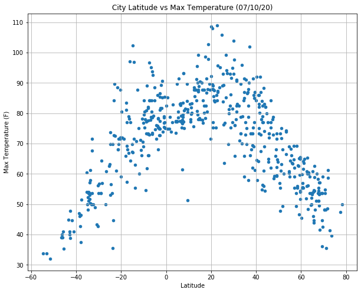
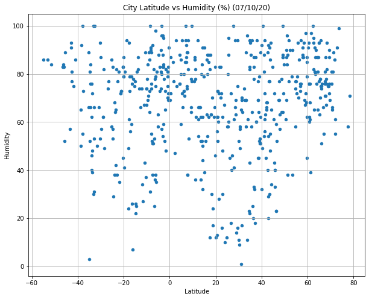
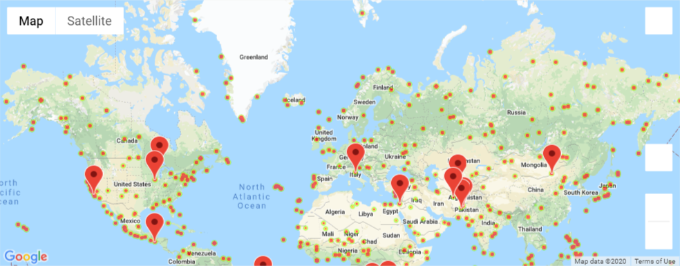

# Python API Challenge

## Background

Whether financial, political, or social -- data's true power lies in its ability to answer questions definitively. So let's take what you've learned about Python requests, APIs, and JSON traversals to answer a fundamental question: "What's the weather like as we approach the equator?"

Now, we know what you may be thinking: _"Duh. It gets hotter..."_

But, if pressed, how would you **prove** it?

## Part I - WeatherPy

Observations:
The data is restricted to the 548 cities randomly selected.  When broken up between the Norther and Southern there was 184 and 364 respectively.
1)	There is correlation between the latitude and the max temperature of a city.  The closer to the equator the higher the temp in both the southern and northern hemisphere.

2)	There is a minor correlation between the latitude and humidity when looking at the northern hemisphere, and a small correlation with the latitude and wind speed for the southern hemisphere.

3)	There looks to be no substantial correlation with the latitude and humidity for the southern hemisphere and latitude and cloudiness for the northern hemisphere.

### Part II - VacationPy

 Used jupyter-gmaps and the Google Places API to randomly select an area and pick a Hotel.  Provided information on that hotel when clicking on the drop point.
 

 
